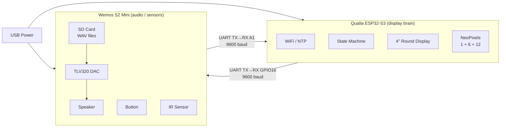
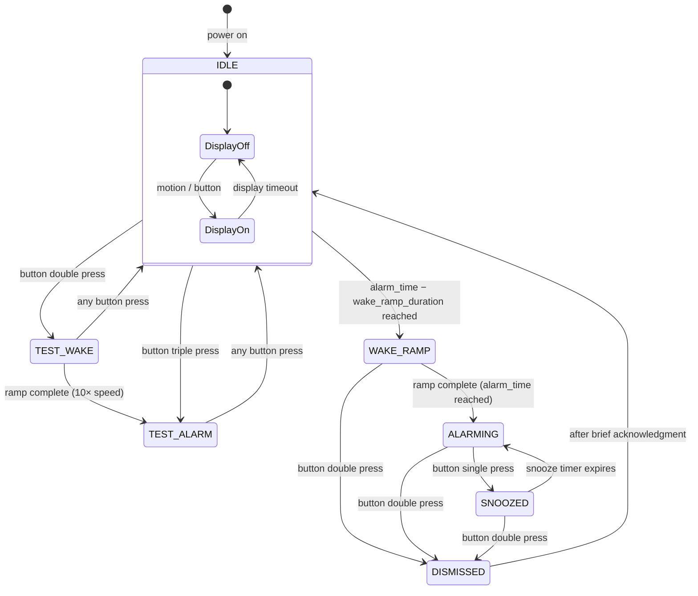

# Robot Alarm — Design Document

## System Architecture



---

## Alarm State Machine



> **DISPLAY** — button single press in IDLE / WAKE_RAMP / SNOOZED, or MOTION from IR sensor: if display is off, turn it on (soft mode) and reset timeout. Does not change alarm state.

---

## Per-State Behavior

| State | Display | NeoPixels | Sound | Single press | Double press | Triple press |
|---|---|---|---|---|---|---|
| **IDLE (display off)** | Off | Off | Silent | Show display | TEST_WAKE | TEST_ALARM |
| **IDLE (display on)** | Soft, auto-off | Off | Silent | Reset timeout | TEST_WAKE | TEST_ALARM |
| **WAKE_RAMP** | Off unless triggered | Warm ramp | Wake song, ramping vol | Show display | Dismiss | — |
| **ALARMING** | Awake (bright) | Alarm effect | Alarm song | Snooze | Dismiss | — |
| **SNOOZED** | Awake (stays on) | Max wake state | Wake song, max vol | Show display | Dismiss | — |
| **DISMISSED** | Soft briefly, then off | Off | Silent | — | — | — |
| **TEST_WAKE** | Off unless triggered | Warm ramp (10× speed) | Wake song, ramping vol | Exit → IDLE | Exit → IDLE | Exit → IDLE |
| **TEST_ALARM** | Awake (bright) | Alarm effect | Alarm song | Exit → IDLE | Exit → IDLE | Exit → IDLE |

Button window: 600 ms in IDLE (needs triple-press discrimination); 400 ms in all other states.

---

## Wake Ramp — NeoPixel & Audio Detail

The wake ramp spans from `alarm_time − wake_ramp_duration` to `alarm_time`.
Progress `t` goes from 0.0 → 1.0 over that window.

### NeoPixel Phases

Two selectable directions — same color curve and phase timing, different ring order:

| ID | Name | Ring order |
|---|---|---|
| `sunrise_out` | Sunrise (center out) | Center → Inner → Outer |
| `sunrise_in` | Radiating Dawn (outer in) | Outer → Inner → Center |

```
t = 0.0 ──────── 0.33 ──────── 0.66 ──────── 1.0
         Phase 1      Phase 2       Phase 3
         First ring   + Second      + Third
         Red-orange  → Orange     → Warm white
         Dim → mid    Fade in      Fade in → full
```

| Phase | sunrise_out pixels | sunrise_in pixels | Color range | Brightness |
|---|---|---|---|---|
| 1 (t: 0.0→0.33) | Center (1) | Outer (12) | Red-orange `#FF3200` | Fades 0 → mid |
| 2 (t: 0.33→0.66) | Center + Inner (7) | Outer + Inner (18) | Orange → warm yellow `#FFAA00` | Second ring fades 0 → mid; first holds |
| 3 (t: 0.66→1.0) | All 19 | All 19 | Warm yellow → bright warm white | All increase to max |

`max_brightness` is a tunable setting — not necessarily full LED output.

### Volume Ramp

```
t = 0.0 ──── volume_ramp_end ──── 1.0
       Ramp 0→wake_max_vol   Hold wake_max_vol
```

- `volume_ramp_end` (default 0.7): fraction of ramp where volume reaches max
- Wake song loops continuously throughout; volume is updated each loop

---

## Alarm Lighting Effects

Seven named effects, each looping during ALARMING. Parameters vary per effect — unused parameters are omitted from config.

### Named Colors

Used in effect `color` / `color2` fields:

| Name | Character |
|---|---|
| `warm_white` | W-channel dominant, slight red-orange bias |
| `cool_white` | W-channel dominant, slight blue bias |
| `pure_white` | W-channel only |
| `red` | |
| `orange` | |
| `amber` | Red-orange-yellow |
| `yellow` | |
| `green` | |
| `cyan` | |
| `blue` | |
| `purple` | |
| `magenta` | |

### Speed Values

`"slow"` / `"medium"` / `"fast"` — exact timing per effect below.

---

### Effect Reference

#### `SOLID`
All 19 pixels at fixed color and brightness. No animation.

| Parameter | Type | Notes |
|---|---|---|
| `color` | named color | |
| `brightness` | 0.0–1.0 | |

---

#### `PULSE`
All 19 pixels breathe between a dim floor and `brightness`.

| Parameter | Type | Notes |
|---|---|---|
| `color` | named color | |
| `brightness` | 0.0–1.0 | Peak brightness |
| `speed` | slow / medium / fast | Cycle: 6 s / 3 s / 1.5 s |

---

#### `CHASE`
One bright pixel orbits the outer 12-ring; inner 7 held at ~15% fill.

| Parameter | Type | Notes |
|---|---|---|
| `color` | named color | Chasing pixel color |
| `brightness` | 0.0–1.0 | |
| `speed` | slow / medium / fast | Orbit: 3 s / 1.5 s / 0.75 s |

---

#### `SUNRISE`
Holds the max wake-ramp state (all 19, warm white). No animation.

| Parameter | Type | Notes |
|---|---|---|
| `brightness` | 0.0–1.0 | |

---

#### `WAVE`
Bright sweep from center → inner → outer ring, then resets and repeats.

| Parameter | Type | Notes |
|---|---|---|
| `color` | named color | |
| `brightness` | 0.0–1.0 | |
| `speed` | slow / medium / fast | Sweep: 1.5 s / 0.6 s / 0.25 s |

---

#### `DUAL_SPIN`
One pixel orbits the outer 12-ring clockwise; one orbits the inner 6-ring counter-clockwise simultaneously.

| Parameter | Type | Notes |
|---|---|---|
| `color` | named color | Outer ring pixel |
| `color2` | named color | Inner ring pixel |
| `brightness` | 0.0–1.0 | |
| `speed` | slow / medium / fast | Orbit: 3 s / 1.5 s / 0.75 s |

---

#### `FLASH`
Alternates between inner group (center + inner 6) and outer group (outer 12).

| Parameter | Type | Notes |
|---|---|---|
| `color` | named color | Inner group (center + 6) |
| `color2` | named color | Outer group (12) |
| `brightness` | 0.0–1.0 | |
| `speed` | slow / medium / fast | Full cycle: 2 s / 1 s / 0.5 s |

---

## UART Protocol

### Qualia → S2 Mini

| Command | When |
|---|---|
| `PLAY WAKE\n` | Entering WAKE_RAMP or TEST_WAKE |
| `PLAY ALARM\n` | Entering ALARMING or TEST_ALARM |
| `PLAY SNOOZE\n` | Entering SNOOZED |
| `STOP\n` | Entering DISMISSED, IDLE, or exiting any test mode |
| `VOL 0.75\n` | Volume update during wake ramp (sent repeatedly) |
| `STATE IDLE\n` | Broadcast on every state transition; also sent in response to `GET_STATE` |
| `STATE WAKE_RAMP\n` | Same |
| `STATE ALARMING\n` | Same |
| `STATE SNOOZED\n` | Same |
| `REQUEST_CONFIG\n` | Qualia requests S2 Mini to re-send full config block |

### S2 Mini → Qualia

| Command | When |
|---|---|
| `DISPLAY\n` | Single press in IDLE, WAKE_RAMP, or SNOOZED |
| `SNOOZE\n` | Single press in ALARMING |
| `DISMISS\n` | Double press in WAKE_RAMP, ALARMING, or SNOOZED |
| `TEST_WAKE\n` | Double press in IDLE |
| `TEST_ALARM\n` | Triple press in IDLE |
| `MOTION\n` | IR sensor triggered |
| `GET_STATE\n` | Sent once at boot after hardware init; requests current state |
| `CONFIG_START\n` … `CONFIG_END\n` | Full config block; sent at boot and on `REQUEST_CONFIG` |

---

## Board Responsibilities

### Qualia
- Owns the **state machine**
- Keeps time via **WiFi / NTP**
- Drives **display** (clock when on, soft/awake modes)
- Drives **NeoPixels** (all effects computed here)
- Sends PLAY / STOP / VOL commands to S2 Mini
- Receives SNOOZE / DISMISS / MOTION from S2 Mini

### S2 Mini
- Plays WAV files from SD card on command
- Manages **volume** as instructed
- Reads **button** → encodes single/double press → sends SNOOZE/DISMISS
- Reads **IR sensor** → sends MOTION
- No state logic — executes commands, reports events

---

## Sound Files

| File | Used in |
|---|---|
| `/sd/sounds/wake.wav` | WAKE_RAMP + SNOOZED (loops) |
| `/sd/sounds/alarm.wav` | ALARMING (loops) |

All files: 44100 Hz, 16-bit PCM, mono. CircuitPython's I2SOut duplicates mono to both I2S channels automatically.

---

## Configuration (`alarm_config.json` on S2 Mini SD card)

```json
{
  "alarm": {
    "hour": 7,
    "minute": 0,
    "days": "weekdays"
  },
  "timing": {
    "wake_ramp_minutes": 10,
    "snooze_minutes": 9,
    "max_snoozes": 3,
    "display_timeout_s": 30,
    "volume_ramp_end": 0.7
  },
  "audio": {
    "wake_song": "/sd/orchestral/morning_mood_short.wav",
    "alarm_song": "/sd/songs/eye_of_the_tiger.wav",
    "wake_max_volume": 0.6,
    "alarm_volume": 0.9
  },
  "neopixels": {
    "wake": {
      "direction": "sunrise_out",
      "max_brightness": 0.8
    },
    "alarm": {
      "effect": "PULSE",
      "brightness": 0.8,
      "color": "warm_white",
      "speed": "medium"
    }
  }
}
```

Single-color effects (`SOLID`, `PULSE`, `CHASE`, `WAVE`) use `color` only.
Two-color effects (`DUAL_SPIN`, `FLASH`) use both `color` and `color2`.
`SUNRISE` uses `brightness` only — no color or speed.

---

## Open Questions

- **Time without WiFi** — fallback if NTP fails? Boot with a manually set time?
- **Alarm days** — weekday/weekend/daily enough, or do we need per-day selection?
- **Max snooze** — after N snoozes, force dismiss or keep going indefinitely?
- **MOTION during ALARMING** — only wakes display (already in awake mode, so no-op) or should it do something else?
- **Display content** — when display is ON (soft or awake mode), what does it show? Clock only? Anything else?
